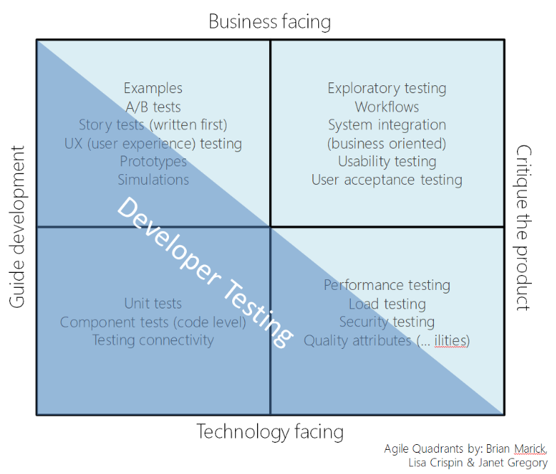

# 5주차 DI & Spring Test

1.  Dependency Injection

    * Factory Pattern
    * Singleton Pattern : 생성자가 여러 차례 호출되더라도 실제로 생성되는 객체는 하나이고 최초 생성 이후에 호출된 생성자는 최초의 생성자가 생성한 객체를 리턴한다.
    * IoC : 제어 반전이 적용된 구조에서는 외부 라이브러리의 코드가 프로그래머가 작성한 코드를 호출한다. \
      스프링이 개발자 대신 객체를 제어하기 위해서는 객체들이 빈(Bean)으로 등록되어있어야 한다.
    * DI (의존성 주입) : IoC에서 관리하고 있는 Bean들 중에서 필요한 것을 객체에 주입하는 것\
      @Autowired 사용
      * 필드 주입
      * 수정자 주입
      * 생성자 주입
    * beanFactory.getBean
    * Test Code 작성 시 given, when, then Template 사용
    * @Bean : 메소드 레벨에서 선언하며, 반환되는 객체(인스턴스)를 개발자가 수동으로 빈으로 등록하는 애노테이션이다.
    * @Component : 클래스 레벨에서 선언함으로써 스프링이 런타임시에 컴포넌트스캔을 하여 자동으로 빈을 찾고(detect) 등록하는 애노테이션
    * @Configuration : 외부라이브러리 또는 내장 클래스를 Bean으로 등록하고자 할 경우 사용
    * spring core 에 관련된 내용

2.  Unit Test

    * V 모델은 개발 생명 주기의 각 단계와 그에 상응하는 소프트웨어 시험의 각 단계의 관계를 보여준다.&#x20;
    * 내적 품질 : 소프트웨어 디자인에대한 품질
    * 외적 품질 : 목적성에 맞는지에대한 품질
    * Test Matrix : 개발자의 테스팅 영역을 표시

    &#x20;       

    * JUnit5 : 자동화된 테스트를 지원하는 도구. 이름에 Unit이 들어가지만 단위 테스트만 지원하는 건 아님. 통합 테스트, 심지어는 E2E 테스트를 작성하는데도 사용한다.
      * @Test, @DisplayName(“ ”),@BeforeEach 등 Annotation을 지원한다.
    * NewtonMethod Test 방법 예시 소개
    *   Test Pyramid(bottom to top)

        &#x20; 1\) Unit Tests

        &#x20; 2\) Service Tests\
        &#x20; 3\) User Interface Tests

3. Spring Test(IntegrationTest)
   * UnitTest vs IntegrationTest 차이
   * @SpringbootTest Annotation을 써서 쉽게 테스트할 수 있다.
     * 서버를 실행시켜 테스트하는 방법
     * restTemplate.postForLocation(url, postDto);&#x20;
     * String body = restTemplate.getForObject(url, String.class);
   * MockMvc를 써서 Http 요청을 흉내낼 수 있다.
   * SpyBean
     * `@MockBean`은 `given`에서 선언한 코드 외에는 전부 사용할 수 없습니다.\
       반면에 `@SpyBean`은 `given`에서 선언한 코드 외에는 전부 실제 객체의 것을 사용합니다.
     * 참고 : [https://jojoldu.tistory.com/226](https://jojoldu.tistory.com/226)
   * MockBean : 빠르게 테스트하기 위해 응답값을 임의로채워 넣을 수 있다.
     * Mvc.perform & verify 수행\

4. TDD
   * 자동화된 단위 테스트 코드를 먼저 작성함으로써 테스트가 개발을 이끌어나가도록 하는 방식

